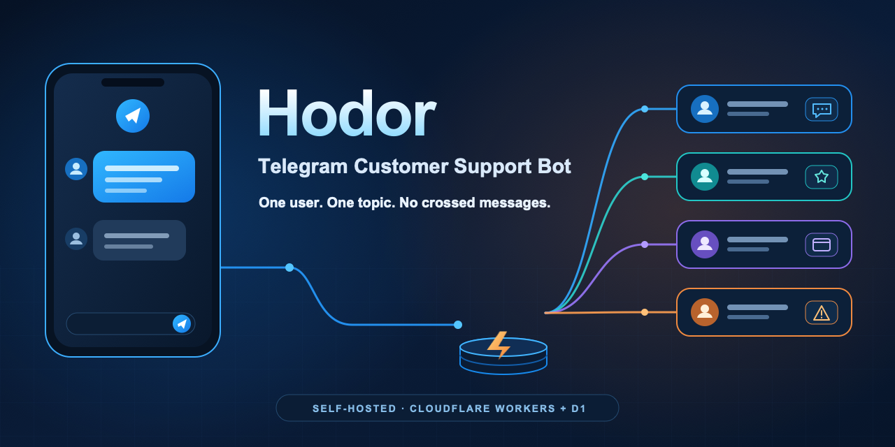
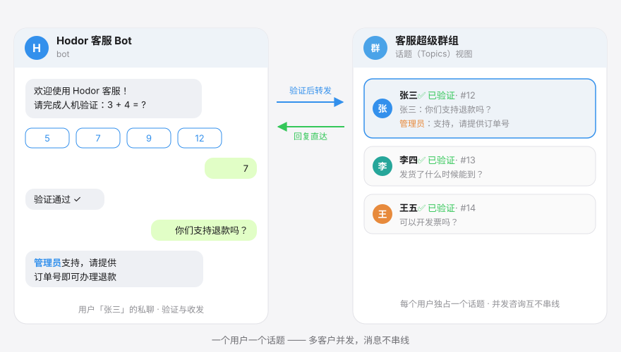
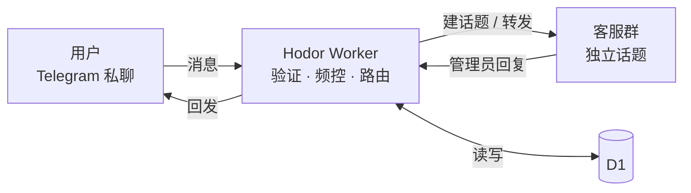

<div align="center">

# Hodor

**Telegram 话题式客服机器人 —— 一个用户，一个话题，消息不串线**

自部署于你自己的 Cloudflare（Workers + D1）：用户私聊 Bot，消息自动进入客服超级群的独立话题；
管理员在话题里直接回复，即时送达用户私聊。数据只经过你自己的 Worker 与数据库，不经第三方中转。

[在线文档](https://huaiminyetnotsleep.github.io/hodor/) · [快速开始](#快速开始) · [部署指南](docs/guide/deploy.md) · [路线图](docs/todo/index.md) · [报告问题](https://github.com/huaiminyetnotsleep/hodor/issues)

[](https://github.com/huaiminyetnotsleep/hodor/actions/workflows/ci.yml)
[](LICENSE)
[](https://nodejs.org/)
[](https://developers.cloudflare.com/workers/)

</div>

<p align="center">
  
</p>

<p align="center">
  
</p>

---

## 为什么选择 Hodor

- **数据 100% 自持** —— 对话数据只落在你自己的 Worker 与 D1 数据库，无第三方 SaaS 中转，无遥测
- **私聊体验，群组效率** —— 每个用户独占一个群组话题，多客户并发互不串扰，管理员多人协作同一收件箱
- **免费套餐即可起步** —— Cloudflare Workers + D1 免费额度足够运行小型客服场景，成本透明可控
- **五分钟完成部署** —— 纯浏览器 fork 部署或一条命令，D1 建库、绑定、迁移全部自动完成

## 功能特色

| 特色 | 主要优势 |
| --- | --- |
| 双向私聊直达 | 用户像加好友一样私聊 Bot 即可发起咨询；管理员在群话题里回一句，用户即刻收到——无需引用消息、无需切换工具 |
| 一人一话题，永不串线 | 每个用户独占一个群组话题，多个客户同时咨询互不干扰；映射长期复用，回访自动接上原话题 |
| 七类媒体原样转达 | 图片 / 视频 / 语音 / 音乐 / 文件 / 贴纸 / 动图按 Telegram `file_id` 直传——不下载、不落盘，速度与保真兼得 |
| 人机验证挡机器人 | 默认数学题 + 按钮验证，可切纯按钮模式；未验证消息直接丢弃不积压，有效期与开关可配 |
| 频率限制防滥用 | 每用户每分钟转发上限（默认 20 条），超限自动触发重验；提示类回复另有频控，防止反向轰炸管理员 |
| 15 条管理命令 | 封禁 / 备注 / 风险标记 / 验证控制 / 会话归档·删除·清空 / 全员公告，部署后自动注册进客服群命令菜单，触手可及 |
| 全员公告一键触达 | `/broadcast` 一条公告经预览确认送达全部历史用户私聊（含归档用户，排除封禁）；General 留存全文与完成统计，可回溯 |
| 会话有始有终 | 软归档保留历史与备注、物理删除二次确认、Telegram 原生关话题自动同步自愈——处置权始终在你手里 |
| 部署完即可观测 | `/health` 纯存活探针可直接挂 uptime 监控；`/selfcheck` 全量自检、失败项逐条中文点名且不回显密钥，排障不求人 |
| 多实例独立运行 | 同一份 fork 可部署多个 Worker，各有独立 D1、Bot 与客服群；也可用新实例承接换 Bot 或换群组 |
| 经得起边界情况 | Webhook 幂等去重、失败自动重推、防毒丸上限（`MAX_ATTEMPTS`）、Telegram 429 有界重试——丢消息有底线 |

## 工作原理



用户与话题的映射长期复用；归档后回访恢复原话题，仅 `/deluser` 或话题被原生删除后才建立新映射。
数据流与模块边界详见[原理与架构](docs/guide/architecture.md)。

> [!IMPORTANT]
> **每个实例是单 Bot、单客服群**。多个独立实例可用于多业务运营及换 Bot / 换群组；新实例会重新建档、验证和创建话题，旧数据留在旧实例，不会自动接续原话题或资料。

## 快速开始

### 前置条件

- 一个 Telegram Bot（[@BotFather](https://t.me/BotFather) 创建）
- 一个开启话题（Topics）的**私有**超级群组，Bot 授予四项权限：**管理话题 / 发送消息 / 删除消息 / 置顶消息**
- 客服群 `chat_id` 与管理员 `user_id`（获取方法见下表）
- 一个 Cloudflare 账户（免费套餐即可运行，用量受配额约束）

**获取两个 Telegram ID**

| 变量 | 获取方法 |
| --- | --- |
| 客服群 `chat_id`（`-100` 开头负数） | Bot 进群后往群里随便发一条消息，浏览器打开 `https://api.telegram.org/bot<BOT_TOKEN>/getUpdates`，记下返回中的 `chat.id`；或邀请 [@sc_ui_bot](https://t.me/sc_ui_bot)、[@getidsbot](https://t.me/getidsbot) 等工具 bot 进群后发 `/id` |
| 管理员 `user_id` | 同上 `getUpdates` 返回中你那条消息的 `from.id`；或在 Telegram 内向 [@getidsbot](https://t.me/getidsbot) 私聊发任意消息，直接读出自己的 user ID |

### 方式一：fork 后部署（推荐）

全程浏览器，push 即自动部署。

1. Fork 本仓库到你的 GitHub 账号
2. 打开 Cloudflare 面板 → Workers & Pages → Create → Workers → **Import a repository**，授权 GitHub 后选中你的 fork
3. 向导保持默认（项目名 `hodor`、构建命令留空、部署命令 `npx wrangler deploy`），保存后自动完成首次部署
4. 此后每次 push 到 `main` 即自动发布新版本

> [!TIP]
> fork 后可选开启**自动跟随更新**：在你 fork 仓库的 GitHub 页面 → **Actions** 启用 **Sync fork from upstream** 工作流，即可每周自动快进到官方最新版并触发重新部署；也可随时点 **Run workflow** 立即同步。
>
> 默认关闭，不影响手动跟随；行为边界见[发布与更新](docs/guide/release.md)。

### 方式二：Deploy 按钮

没有现成仓库时，点击按钮由 Cloudflare 自动创建仓库副本并完成部署：

[](https://deploy.workers.cloudflare.com/?url=https://github.com/huaiminyetnotsleep/hodor)

### 方式三：手工 wrangler

不依赖 GitHub，本地需 Node ≥ 24：

```bash
npx wrangler login
npm run deploy
```

> [!TIP]
> 三条路径共用同一套仓库配置：D1 建库、绑定与表迁移自动完成；变量值一律不进仓库，部署后在 Cloudflare 面板「变量和机密」配置。

部署后统一收尾：

1. 配置 9 个环境变量（`/selfcheck` 会逐条点名缺失项）
2. 绑定 webhook
3. 复检全绿
4. 试聊验收

完整分步说明见 **[部署指南](docs/guide/deploy.md)**；日常更新与回滚见[发布与更新](docs/guide/release.md)；多业务运营或换 Bot / 换群组，见[部署多个实例](docs/guide/deploy.md#部署多个实例)。

## 关键配置与命令

### Cloudflare 环境变量

配置入口：Cloudflare 面板 → Worker → 设置 → **变量和机密**。三个 Secret 请使用互不相同的长随机串；仓库已开启 `keep_vars`，面板配置跨部署保留，变量值一律不进仓库。

| 变量 | 类型 | 必填 | 默认 | 说明 |
| --- | --- | --- | --- | --- |
| `TELEGRAM_BOT_TOKEN` | Secret | ✅ | — | Bot Token（@BotFather 获取） |
| `TELEGRAM_WEBHOOK_SECRET` | Secret | ✅ | — | Webhook 防伪造密钥（≥ 16 位） |
| `ADMIN_SECRET` | Secret | ✅ | — | `setwebhook` 管理端点访问凭证 |
| `SUPPORT_CHAT_ID` | 文本 | ✅ | — | 客服群 ID（`-100` 开头） |
| `ADMIN_IDS` | 文本 | ✅ | — | 管理员用户 ID，逗号分隔可多个 |
| `MAX_MESSAGES_PER_MINUTE` | 文本 | — | `20` | 每用户每分钟转发上限，超限触发重验 |
| `VERIFY_TTL_HOURS` | 文本 | — | `0` | 验证有效期（小时），`0` = 永久 |
| `MAX_ATTEMPTS` | 文本 | — | `3` | 同一条更新最大重试次数，超限跳过 |
| `WELCOME_TEXT` | 文本 | — | 内置文案 | 自定义欢迎语，字面 `\n` 解释为换行 |

配置完成后访问 `https://<worker-url>/setwebhook/<ADMIN_SECRET>` 绑定 webhook（同时自动注册命令菜单），再用 `/selfcheck` 复检。

### 管理命令

在客服群对应话题内发送，仅 `ADMIN_IDS` 中的管理员生效；`/broadcast` 为例外，须在客服群 General 发起。部署后自动注册进群命令菜单（输入框点 `/` 直接选择）。

| 命令 | 作用 |
| --- | --- |
| `/help` | 查看管理命令帮助（按当前验证开关动态展示） |
| `/ban` `/unban` | 封禁 / 解封本话题用户 |
| `/note` `/unnote` | 添加 / 清除用户备注 |
| `/risk` `/unrisk` | 标记 / 取消高危用户 |
| `/verifyon` `/verifyoff` `/verifymode` | 开启 / 关闭人机验证、切换验证模式（即时生效，无需重部署） |
| `/archive` | 软归档本话题用户（保留历史与备注，回访复用原话题） |
| `/deluser` | 物理删除用户及本话题（需确认） |
| `/purgemsg` | 清理本话题可追踪的群消息 |
| `/broadcast` | 向全部用户群发公告（**仅限客服群 General 发起**，预览确认后发送） |
| `/wipealldata` | 删除全部话题并清空数据库（**危险操作**，两步确认） |

完整行为与边界说明见[功能介绍](docs/guide/features.md)。

### 常用命令

```bash
npm run deploy            # 一键部署：自动建/复用 D1 → 远端迁移 → 部署（迁移失败即中止）
npm run dev               # 本地开发（wrangler dev + 本地 D1，需先 db:migrate:local）
npm run db:migrate:local  # 应用本地 D1 迁移
npm test                  # 运行测试（vitest + workers 池）
npm run typecheck         # TypeScript 类型检查
npm run docs:dev          # 本地预览文档站
```

## 文档

| 页面 | 内容 |
| --- | --- |
| [功能介绍](docs/guide/features.md) | 消息类型、验证与频控、命令表、会话生命周期 |
| [部署指南](docs/guide/deploy.md) | 前置条件、ID 获取、环境变量权威清单、三条部署路径、部署后验收 |
| [运维手册](docs/guide/ops.md) | Webhook 与 Token 管理、`/health` 与 `/selfcheck`、故障排查、SQL 入口 |
| [原理与架构](docs/guide/architecture.md) | 模块边界、消息流水线、设计决策（维护者参考） |
| [数据表](docs/guide/database.md) | Schema 与语义（维护者参考） |
| [本地开发](docs/guide/development.md) | Node 24、测试基座、本地 Worker 与 D1 |
| [发布与更新](docs/guide/release.md) | 维护者发版流程与 fork 用户跟随更新（含可选自动同步） |
| [路线图](docs/todo/index.md) | 明确标注的未来事项 |

## 参与贡献

欢迎通过 [Issue](https://github.com/huaiminyetnotsleep/hodor/issues) 反馈问题或提议功能；提交 PR 前请阅读[本地开发指南](docs/guide/development.md)，并确保 `npm test` 与 `npm run typecheck` 通过。

## 致谢

Hodor 的设计与文档参考了以下优秀的开源项目，特此感谢。

**设计参考**

- [ctt](https://github.com/iawooo/ctt) —— 数学题验证 + 答案按钮、分钟级限频超限重验、D1 + 话题映射的整体形态
- [BetterForward](https://github.com/SideCloudGroup/BetterForward) —— 话题置顶用户信息、管理命令设计
- [open-wegram-bot](https://github.com/wozulong/open-wegram-bot) —— 无状态转发思路、webhook `secret_token` 鉴权

**文档样式参考**

- [grammY](https://github.com/grammyjs/grammY) · [Uptime Kuma](https://github.com/louislam/uptime-kuma) · [Memos](https://github.com/usememos/memos)

## License

[MIT](LICENSE) © huaiminyetnotsleep
